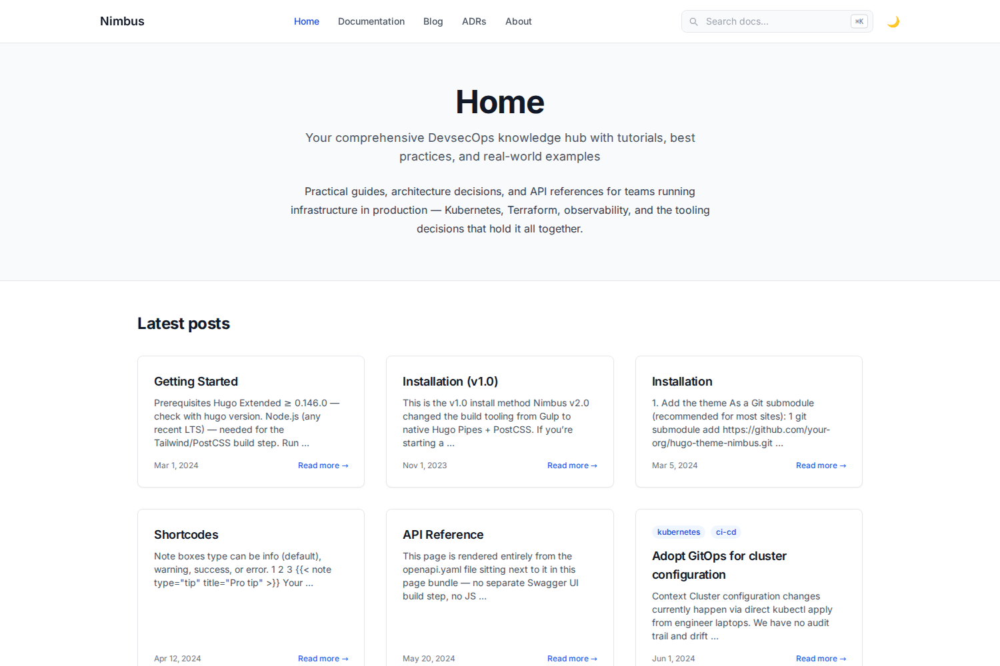

# Nimbus

A Tailwind CSS Hugo theme for DevOps knowledge hubs — blog posts, sidebar-navigation
reference docs, and runbooks, all in one theme.



## Features

- ⚪ Clean, white/light-first design by default, with a genuinely working dark
  mode (persisted via `localStorage`, respects system preference on first
  visit, no flash-of-wrong-theme on load)
- ⌨️ Keyboard-first navigation: `Cmd/Ctrl+K` or `/` to jump to search,
  `↑`/`↓` to move through results, `Enter` to open, `Esc` to close
- 🔍 Client-side search (Lunr.js, vendored locally — no third-party CDN
  dependency for core search to keep working)
- 📚 Sidebar-navigation docs layout with auto table-of-contents and prev/next
- 🎨 Syntax-highlighted code blocks (Chroma, light + dark variants) and tabbed
  multi-language code blocks
- 🖥️ Terminal, note/warning/tip callout, badge, and Mermaid-diagram shortcodes
- 🏷️ Tags, categories, authors, and technologies taxonomies
- 🔗 Open Graph, Twitter Card, and JSON-LD structured data out of the box
- 📱 Responsive, accessible (visible focus rings for keyboard users)

### What sets Nimbus apart

- 🧩 **Native OpenAPI spec rendering** — drop a spec file into a page bundle
  and get interactive, collapsible endpoint docs (method badges, parameters,
  request/response schemas). Rendered entirely by Hugo's own YAML/JSON
  parser at build time — no Swagger UI bundle, no JS widget, nothing to keep
  in sync separately. See `/docs/api-reference/`.
- 📋 **Architecture Decision Records as a first-class content type** — a
  dedicated `adr` section with status badges (proposed / accepted /
  deprecated / superseded), a timeline index, and an archetype so
  `hugo new adr/000x-title.md` scaffolds the Context/Decision/Consequences
  format for you. See `/adr/`.
- 🔀 **Real diff rendering** — a `diff` shortcode wraps Hugo's built-in Chroma
  diff lexer with a file-name header bar and full-row red/green backgrounds,
  for genuine unified-diff syntax (not just a side-by-side code comparison).
  See the Shortcodes doc page.

## Quickstart

```bash
git clone https://github.com/k-s-pavan-kumar/hugo-nimbus.git
cd hugo-theme-nimbus/exampleSite
npm install
hugo server -D
```

Open `http://localhost:1313`. The example site embeds a working copy of the
theme at `exampleSite/themes/nimbus`, so no extra flags are needed. See
[`exampleSite/content/docs/`](exampleSite/content/docs/) for full
installation and usage docs (also rendered live at `/docs/` when you run the
example site).

## Requirements

- Hugo **Extended** ≥ 0.146.0
- Node.js (any current LTS) — for the Tailwind/PostCSS build step

## Using Nimbus in your own site

```bash
cd your-site
git submodule add https://github.com/k-s-pavan-kumar/hugo-nimbus.git themes/nimbus
```

Set `theme = "nimbus"` in your `hugo.toml`, then copy `package.json`,
`postcss.config.js`, and `tailwind.config.js` from `exampleSite/` into your
site root and run `npm install`. Full walkthrough: `/docs/installation/` in
the example site.

## How the CSS build works

Tailwind is compiled to `assets/css/tailwind.built.css` by a plain,
one-shot CLI call — **not** through Hugo's PostCSS pipeline. Hugo only
minifies and fingerprints that already-compiled file using its own native
(Go) minifier at build time.

This means `hugo server -D` and `hugo --minify` have **no Node.js
dependency at all** once `tailwind.built.css` exists — it's a plain,
portable, committed file, so a fresh clone/unzip works immediately even
before running `npm install`. You only need Node when you actually change
styles or Tailwind content sources:

```bash
npm install
npm run watch-css   # recompiles on change, run alongside `hugo server -D`
# or
npm run build-css   # one-shot recompile
```

We deliberately avoided Hugo's built-in `css.PostCSS` pipeline (and the
"commit a pre-built `/resources` cache" pattern some Hugo showcase
submissions use) after hitting two separate classes of fragility with it:
a resource-cache content hash that didn't match across OS/npm versions, and
an upstream Node 24 permission-model bug in `browserslist` that Hugo's
persistent PostCSS process triggers (tracked at
[browserslist/browserslist#899](https://github.com/browserslist/browserslist/issues/899)).
A plain committed CSS file sidesteps both.

## License

MIT — see [LICENSE](LICENSE).

## Submitting to the Hugo themes showcase

The theme itself is technically ready (builds clean with and without npm,
no console errors, has `theme.toml` + showcase-sized screenshots in
`images/`). What's left is entirely repo/account setup that has to happen
on your end:

1. **Create the real GitHub repo** (convention: `hugo-theme-nimbus`), push
   this code to it, and add the topic `hugo-theme` to the repo.
2. **Replace every `your-org` placeholder** with your actual repo path:
   ```bash
   grep -rl "your-org" --include="*.toml" --include="*.md" .
   ```
   (`theme.toml`, `README.md`, and a few doc pages under `exampleSite/content/`)
3. **Deploy the example site** — push to `main` with GitHub Pages enabled
   (Settings → Pages → Source: GitHub Actions); the workflow at
   `.github/workflows/hugo.yml` handles the rest. You'll need this live URL
   for the submission.
4. **Regenerate `images/screenshot.png` / `images/tn.png`** from your
   deployed URL if you change the example content, so the showcase preview
   matches what people actually see.
5. Open a PR against [`gohugoio/hugoThemes`](https://github.com/gohugoio/hugoThemes)
   adding this repo as a submodule, following their `CONTRIBUTING.md`.

A few honest notes for whoever reviews this:

- Mermaid diagrams load `mermaid.min.js` from the jsdelivr CDN (only on
  pages that actually contain a diagram) — this is the one remaining
  external runtime dependency in the theme. Everything else (search, fonts,
  syntax highlighting, CSS) is self-hosted with zero CDN calls.
- `enableGitInfo` is off by default in `exampleSite/hugo.toml` (commented
  out) because it hard-fails the build on a non-git checkout — see the
  comment there before turning it on.
